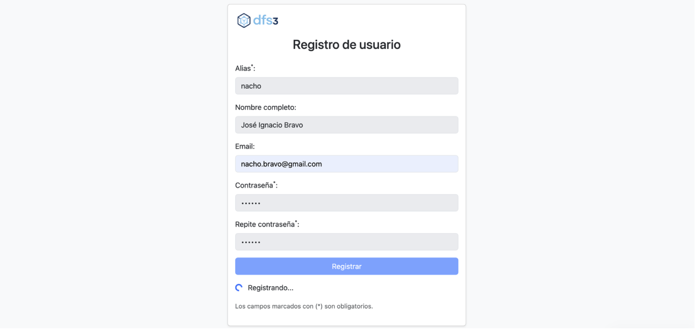

# dfs3: Distributed File System Web 3.0


`dfs3` is a distributed and decentralized file storage system designed as an academic Final Degree Project (TFG). It leverages low-power IoT devices like Raspberry Pi, encrypted storage, and events published on the IOTA Tangle to achieve redundancy, availability, and secure control with no central servers.

## Key Features

- **End-to-end encryption**: Files are encrypted on the client before upload.
- **Web 3.0 architecture**: Fully decentralized with no single points of failure.
- **Event propagation via IOTA + MQTT**: Efficient, auditable, and fault-tolerant communication.
- **Virtual file system**: Based on file paths, symbolic entries, and JSON metadata.
- **Replication across nodes**: Automatic management of redundant storage.
- **User and permission management**: Secure file sharing via encrypted keys.

## Architecture

- **Nodes**: Raspberry Pi devices that store encrypted files and listen to events.
- **Users**: Interact through nodes to upload, share, and download files.
- **REST Microservices**: Lightweight interfaces for file and user operations.
- **IOTA + MQTT**: IOTA stores persistent events, MQTT acts as the control channel.

## Repository Structure

```
dfs3/
├── api/               # REST API for users and files
├── core/              # Key logic, events, configuration
├── storage/           # Encrypted local storage and metadata
├── mqtt/              # MQTT client for network events
├── iota/              # Tangle publishing and querying
├── tests/             # Automated tests
├── node.json          # Encrypted node configuration
└── README.md          # This file
```

## Installation

Requires Python 3.10+ and pip:

```bash
# cd /opt
# git clone https://github.com/joseigbv/dfs3.git
# cd dfs3
# pip install -r requirements.txt
```

## Configuration (dynamic dns, TODO)

```bash
# certbot certonly --standalone -d node0.dfs3.net
# ln -s /etc/letsencrypt/live/node0.dfs3.net/fullchain.pem /opt/dfs3/data/
# ln -s /etc/letsencrypt/live/node0.dfs3.net/privkey.pem /opt/dfs3/data/
```

## Usage

### Initialize node

```bash
$ python3 dfs3.py
      _  __     _____ 
   __| |/ _|___|___ / 
  / _` | |_/ __| |_ \ 
 | (_| |  _\__ \___) |
  \__,_|_| |___/____/ 
                             
  dfs3 0.1 - Distributed File Storage System for IoT with Blockchain
  Author: José Ignacio Bravo <nacho.bravo@gmail.com>

  
[LOG] Starting dfs3 system...
[WRN] Database 'data/dfs3.db' doesn't exist, creating...
[LOG] Database 'data/dfs3.db' created successfully.
[LOG] Loading node config...
Enter new passphrase to protect your private key: [secret]
Repeat passphrase: [secret]
Enter a friendly alias for this node: node1
Enter tags for this node (comma-separated): orangepi, test, node, node1
[LOG] Syncing node status...
...
```

If this is the first run, you will be asked for a passphrase to protect your private key. A `node.json` configuration file will be generated.

### Download a file (REST client, TODO)

```bash
$ curl -H "Authorization: Bearer a1b2c3..." https://node0.dfs3.net:3000/api/v1/files/test.txt
```

## System Events

Events are published to IOTA and notified via MQTT.

- `node_registered`: New node joined the network. Includes metadata such as public key, alias, total storage, and software version.
- `node_status`: Periodic heartbeat from the node, containing dynamic information like uptime, available space, and IP address.
- `file_created`: New file made available in the system. Includes metadata, replication strategy, and fragment assignment.
- `file_shared`: File shared with another user. The recipient is authorized and a virtual entry is created in their namespace.
- `file_replicated`: A node has successfully replicated a file fragment and confirms storage by emitting this event.
- `file_deleted`: A file or virtual entry has been removed from the system.
- `file_renamed`: A virtual entry has been renamed or moved.
- `file_accessed`: A user accessed a file. Used for audit purposes or future usage analytics.
- `user_created`: A new user account has been registered, with its public key and associated metadata.
- `user_joined_node`: A user has joined or linked to a specific node in the network.

---

## User Interface

Select node:


Register user:


Login:


Main interface:


Share file:


File upload:


---

## Documentation 

- [TFG](docs/BRAVO_VICENTE_JOSE_IGNACIO_TFG.pdf)
- [Presentación](docs/Presentación.pdf)
- [Demo](docs/Demo.mp4)
- [Resumen](docs/Resumen.mp4)

---

## Academic Motivation

This project is developed as part of the Final Degree Project in the Bachelor's Degree Adaptation Program in Computer Engineering at UNIR. Its objective is to apply Web 3.0 principles to the design of a distributed storage system oriented toward IoT, with a secure, open, and traceable approach.

---

## References

- [IPFS Whitepaper](https://ipfs.io/ipfs/Qm.../whitepaper.pdf)
- [Filecoin Spec](https://spec.filecoin.io)
- [IOTA Whitepaper](https://files.iota.org/papers/whitepaper.pdf)
- [IOTA Wiki](https://wiki.iota.org)
- [IOTA SDK (GitHub)](https://github.com/iotaledger/iota-sdk)
- [IOTA Smart Contracts - Wasp](https://wiki.iota.org/smart-contracts/overview/)
- [Hornet Node Software](https://github.com/iotaledger/hornet)
- [IOTA Identity Framework](https://wiki.iota.org/identity/overview/)
- [Cardano Research](https://iohk.io/en/research/)
- [Erasure Coding IEEE Paper](https://doi.org/10.1109/TIT.2010.2054295)

---

## License

This project is licensed under the MIT License. See the [LICENSE](LICENSE) file for more information.

---

## Contact

Developed by **José Ignacio Bravo Vicente**  
Contact: [nacho.bravo@gmail.com](mailto:nacho.bravo@gmail.com)


